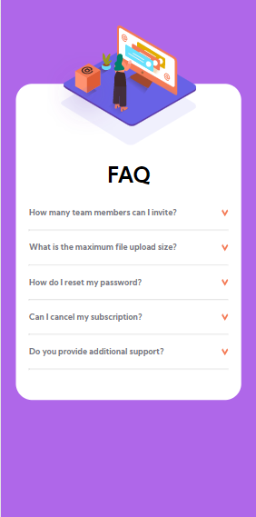
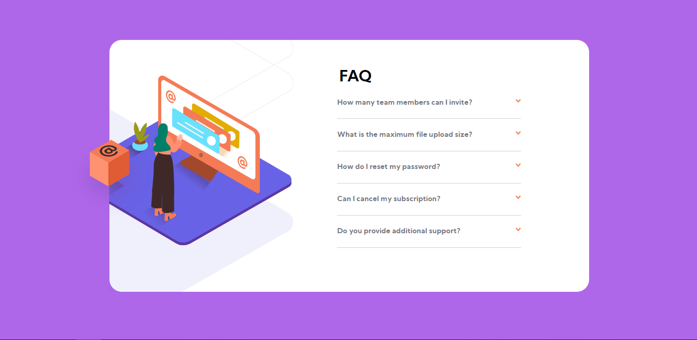

# Frontend Mentor - FAQ accordion card solution

This is a solution to the [FAQ accordion card challenge on Frontend Mentor](https://www.frontendmentor.io/challenges/faq-accordion-card-XlyjD0Oam). Frontend Mentor challenges help you improve your coding skills by building realistic projects.

## Table of contents

- [Overview](#overview)
  - [The challenge](#the-challenge)
  - [Screenshot](#screenshot)
  - [Links](#links)
- [My process](#my-process)
  - [Built with](#built-with)
  - [What I learned](#what-i-learned)
  - [Useful resources](#useful-resources)
- [Author](#author)

**Note: Delete this note and update the table of contents based on what sections you keep.**

## Overview

### The challenge

Users should be able to:

- View the optimal layout for the component depending on their device's screen size
- See hover states for all interactive elements on the page
- Hide/Show the answer to a question when the question is clicked

### Screenshot

### Links

- Solution URL: [Add solution URL here](https://your-solution-url.com)
- Live Site URL: [Add live site URL here](https://your-live-site-url.com)

## My process

### Built with

- Semantic HTML5 markup
- CSS custom properties
- Flexbox
- Mobile-first workflow

### What I learned

I leanerd about css properties like z-index, overflow, visibility, clip-path, JavaScripts events

### Useful resources

- [Developer Mozilla](https://developer.mozilla.org/es/)

- [Stackoverflow](https://stackoverflow.com/)

- [W3schools](https://www.w3schools.com/)

## Author

- Github - [Deadflight](https://github.com/Deadflight)
- Frontend Mentor - [@Deadflight](https://www.frontendmentor.io/profile/Deadflight)
- Twitter - [@Deadfligth](https://twitter.com/Deadfligth)
- Facebook - [@CarlosCorrea](https://www.facebook.com/Carlos-Correa-105811761669254)
- Linkedin - [@CarlosCorrea](https://www.linkedin.com/in/carlos-miguel-correa-millan-155301152/)
